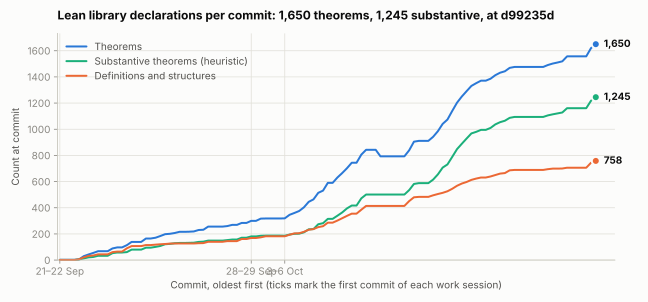
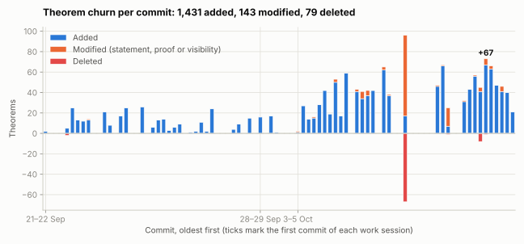
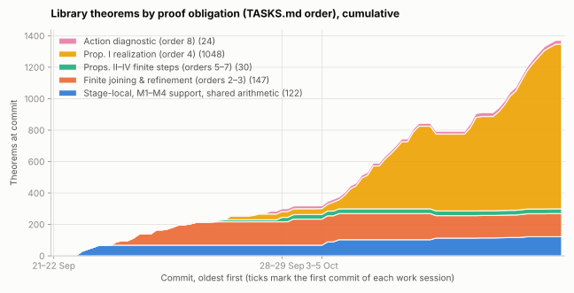
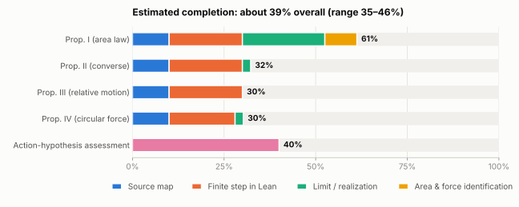

# Newton's changing proof architecture

The [approved goals](research/GOALS.md) target Book I, Section II,
Propositions I–IV in 1687 and 1713 and their De Motu antecedents, with explicit
joining, refinement and trajectory-existence obligations. A universal action
constant is a separate research hypothesis, not a premise of these proofs.
The [three-stage source map](research/SECTION_II.md) records the actual
dependencies; the [obligation queue](research/TASKS.md) separates finite
mechanics, refinement, realization and force identification. Propositions
I–III each have a source-linked note: [Proposition I](research/PROP_I_REALIZATION.md),
[Proposition II](research/TASKS.md) and [Proposition III](research/PROP_III.md).

Current priority is Proposition I, then II, III and IV, retaining all three
stages. The primary forward variant constructs the motion from its impulse
polygons. Its main geometric target is the nonnegative area between polygon
and trajectory, distinct from the radius-swept Kepler area. Follow the
[construction ledger](research/CAUCHY_REALIZATION.md) and
[current checkpoint](research/OVERNIGHT-2026-10-03.md).

Source-linked reconstructions of quadratic deflection, central-impulse polygons,
contact-area bounds and proposed revisions, with separate De Motu, 1687,
proposed-1694, 1713 and 1726 witnesses. Lean 4.19.0 core/Std only; no mathlib.

The supporting M1–M4 milestones remain **incomplete**. Geometric, mechanical
and manuscript gaps remain explicit in
[research state](research/STATE.md), [M1](research/M1.md), [M2](research/M2.md),
[M3](research/M3.md), and [M4](research/M4.md). Historical results are distinct
from conditional reconstructions and coordinate consistency examples.

Evidence: [passages](research/passages.md), [graphs](research/graphs.md),
[edition comparison](research/edition-comparison.md), and
[formal result ledger](research/formal-results.json).

## Progress

The general-force and construction increments (Sol 6.1, 4–5 October) have **1,469 checked
library theorems, 1,087 substantive** by the existing heuristic, across
NewtonLimitDynamics and BarrowLib. All three explicit build targets pass.
The [theorem-growth study](research/THEOREM_PROLIFERATION.md) explains the
foundation work, compatibility overhead and biases in those heuristic counts;
they do not measure discharged obligations.
They construct acceleration values, bound actual sampled polygons and derive
mesh-uniform refinement control and continuous local consistency. General
Lipschitz central samples now have constructed fixed-time motion names/values,
with calibrated windows and explicit actual/shadow force bounds. The harmonic
instance derives these bounds and equals the old endpoint value.
The generic geometry, completion and binary-time layers are now in BarrowLib.
Harmonic E/G agreement at every dyadic rational time and whole-edge convergence are
proved. Same-cell and shared-boundary aliases now give a quotient polygon map.
Actual integer-subdivision accumulation proves the dyadic agreement, including
the three-tick completed values whose finite schedules differ. GeneralForceTime now constructs a continuous local binary-time state/position
map from actual central samples, with uniform prefix convergence, initial/zero
cases and full-endpoint E/G agreement. Its harmonic instance derives the extra
actual-grid bounds and equals the old maps. Local-annulus confinement/gluing,
general interior-time E/G remain open.
GeneralForcePolygonCurve now constructs the general coarse polygon quotient
and proves uniform whole-edge error (T*V+A)/2^m, reusing the same finite-vertex
alias proofs as the harmonic map. GeneralForcePathRegion/Content now construct
the actual general matched region and its cover-independent nonnegative
outer-content scalar, with bound 4*C²/2^m and geometric decay. MatchedRegion
shares cell-closure and connector geometry with the retained harmonic region;
the general harmonic specialization has exactly its old region and content.
GeneralForceSecants now identifies constructed velocity as the uniform
limit of completed bracketing dyadic position secants; the harmonic curve is
a proved corollary. GeneralForceAccelerationSecants now proves uniform
convergence of completed dyadic velocity secants to the force at the constructed
position, with the retained harmonic curve as a corollary. Unrestricted-rate
and ordinary-area identification remain separate. CompletedForce constructs the force at
completed positions and bounds actual prefix force samples uniformly by
(A*L+3*E0)/2^j, independently of the force precision scale. Its harmonic
specialization equals completed scaling by -w. Explicit positive time
calibration now gives weighted finite bounds and dimensionless windows, with
proved Cauchy-gauge and time-unit invariance; it fixes no universal constant.
QuadraticEstimates now derives finite second-order position control with the
explicit half-mesh bias. Actual parallel-force endpoint Cauchy values have the
exact quadratic formula at every nonnegative rational time. The Galilean
potential and tangent-triangle relations apply to those constructed endpoints,
with both coefficients halved. GeneralForceQuadraticSecants now derives the
normalized half-coefficient departure criterion on the actual general curve:
2*(Delta_x/H-v_left)/H converges uniformly to completed force, with error
H*L*(2V+K), including the final boundary. It reuses the existing completed
secants; the harmonic curve is a corollary. ConstructedHarmonicPotential now evaluates the harmonic polynomial potential
on the actual completed curve and its tangent continuation. PairingValues
shares one derived Cauchy/representative proof for dot products and determinants;
QuadraticPotentialValues composes it with existing completed secants. The finite
work identity identifies the polynomial with the harmonic force. Actual node
bounds and the shared finite second-order estimate give a uniform O(H) bound:
Delta V/H² converges to -mass*dot(a_left,a_left)/2 over all dyadic cells,
including the last one. No potential-step asymptotic is assumed. General radial
potentials, unrestricted quotients and the triangle/lobe relation to D_mesh
remain open. This law test receives no extra completion score.

Historical snapshot at `507d041` (4 October 2026, 68 commits). Regenerate with
`python3 scripts/progress_stats.py`; the per-commit numbers behind every plot
are in [history.csv](docs/progress/history.csv).

- **793 library theorems, 501 of them substantive**, and 414 definitions in
  10,709 lines of Lean. Both build targets pass, and no commit in the history
  contains `sorry`. Another 13 theorems are verification harnesses in
  `research/verification/`.
- The classification is a heuristic over statements, defined in
  `scripts/progress_stats.py`. Of the 793, 174 are arithmetic plumbing (only
  fraction/point algebra, determinants, constants or generic list sums), 105
  check specific numbers (counterexamples count as substantive) and 13 repeat
  an earlier statement, mostly the deliberate per-edition restatements of
  one finite result.
- Until 4 October the history was almost purely additive: 845 theorems added,
  24 modified and 2 deleted. Commit `507d041` then merged 50 duplicated helper
  theorems (`add_equiv` alone had 10 private copies) into shared lemmas in
  `Common/RationalMagnitudes.lean`, `TimeSubdivision` and `PointBounds`. The
  total fell from 843 to 793 while the substantive count stayed at 501.
- Growth is recent and concentrated. The 3–4 October session added 314 of the
  501 substantive theorems, and 489 of all 793 (62%) serve the Proposition I
  realization.

<picture>
  <source media="(prefers-color-scheme: dark)" srcset="docs/progress/theorems-total-dark.svg">
  
</picture>

<picture>
  <source media="(prefers-color-scheme: dark)" srcset="docs/progress/theorems-churn-dark.svg">
  
</picture>

<picture>
  <source media="(prefers-color-scheme: dark)" srcset="docs/progress/theorems-by-area-dark.svg">
  
</picture>

**Estimated completion: about 39% (35–46% under alternative weightings), reassessed 5 October.**
This figure is an editorial judgement and certifies nothing. Each proposition
is scored on four milestones weighted by expected difficulty: source map (10%),
finite step in Lean (20%), limiting passage or realization (45%), and area and
force identification (25%). Propositions I–IV carry 22.5% each and the
action-hypothesis assessment 10%. Scores and the evidence for each are in
[completion-estimate.json](docs/progress/completion-estimate.json).

<picture>
  <source media="(prefers-color-scheme: dark)" srcset="docs/progress/completion-dark.svg">
  
</picture>

| Target | Source map | Finite step | Limit / realization | Identification | Estimate |
| --- | --- | --- | --- | --- | --- |
| Prop. I | done | done | harmonic and general Lipschitz local time maps | general Lipschitz outer content; constructed dyadic velocity/force secants | 61% |
| Prop. II | done | done | stated | open | 32% |
| Prop. III | done | done | open | open | 30% |
| Prop. IV | done | finite core | routes documented | open | 30% |
| Action assessment | | | | | 40% |

Under the stricter [completion ledger](research/CONTINUATION.md), no target is
discharged yet. Source maps and finite steps are essentially finished. The
increase from 34% credits whole-edge convergence, agreement of the two harmonic
constructions, calibrated general Lipschitz endpoint and local binary-time maps, and Arg007's exact
finite potential identities, harmonic and general matched-region outer content and
constructed dyadic velocity/force-secants identification. It
gives no extra credit for theorem count,
helper consolidation or foundation migration. Local confinement and gluing,
ordinary-area/Kepler-area identification and P5 unrestricted-rate identification
remain open, as do the limiting passages of Propositions II–IV.
The harmonic time map still uses a short window; the general time map names
its positive calibration, global Lipschitz comparison and actual/coarse/shadow
force bounds explicitly. It constructs BinaryTime rather than assuming a real
trajectory. General interior-time E/G, precision/partition independence and
merely continuous-force existence/uniqueness also remain open.
Modern reconstructions keep their premises separate from De Motu, 1687 and
1713, so this estimate does not certify any historical proposition.

## Working hypothesis: what difficulties might Newton have recognized?

**Educated guess, not an established account of Newton's intentions.** Our
best-supported reading is that he recognized restrictions and ambiguities in
passing between geometric approximations and force-generated motion. The
sources inspected do not establish that he discovered an internal contradiction
in his mechanics. The following ranking separates textual evidence from our
reconstruction; it adds no historical proof-dependency edge.

1. **Quadratic contact needs restricted geometry — strong textual evidence.**
   The 1687 Lemma XI scholium explicitly discusses departures of different
   orders and restricts the curvature; 1713 puts a curvature condition in the
   lemma's statement. Thus Newton demonstrably recognized the danger of
   applying a quadratic comparison beyond its permitted contact geometry.
   This qualification already exists in 1687, so it is not evidence of a
   contradiction first discovered between editions.
   Sources: [1687, NATP00077 par39](https://www.newtonproject.ox.ac.uk/view/texts/diplomatic/NATP00077#par39),
   [1713, NATP00082 par36](https://www.newtonproject.ox.ac.uk/view/texts/diplomatic/NATP00082#par36).

2. **Different measures of departure need a justified correspondence — plausible
   interpretation of the revisions.** The later organization of Proposition VI
   emphasizes a sagitta route, but retains Lemma X as an alternative. It is
   plausible that Newton wanted to secure or clarify the relation between
   generated displacement and geometric departure. Our matched-duration
   constant-force calculation shows why their calibration matters; it does
   not demonstrate that Newton made that numerical error or abandoned the
   earlier argument. Proposition VI is supporting comparison material, outside
   the primary I–IV target.
   Sources: [1713, NATP00082 par89–90](https://www.newtonproject.ox.ac.uk/view/texts/diplomatic/NATP00082#par89),
   [edition-local comparison](research/edition-comparison.md),
   [checked special case](research/M4.md#checked-route-comparison).

3. **Approximating a given curve and constructing a motion are different
   obligations — our leading research conjecture, weak evidence about Newton's
   own diagnosis.** Lemmas II–III begin with geometric figures; Proposition I
   invokes Lemma III corollary 4 when passing from impulsive polygons to
   uninterrupted action. Our question is whether the permitted premises also
   secure a coherent time-to-position map for the constructed polygons.
   The inspected passages do not document Newton identifying this as an
   existence gap. Their retention in 1713 also prevents treating the later
   revisions as evidence that he explicitly repaired it.
   Sources: [1687, NATP00077 par3–10](https://www.newtonproject.ox.ac.uk/view/texts/diplomatic/NATP00077#par3),
   [1687 Proposition I, par45](https://www.newtonproject.ox.ac.uk/view/texts/diplomatic/NATP00077#par45),
   [1713 Proposition I, par51](https://www.newtonproject.ox.ac.uk/view/texts/diplomatic/NATP00082#par51).

4. **Boundaries in every dimension, the boundary theorem in only one — firm
   chronology; the concept rests on one struck-out draft definition.** In the
   draft *De motu corporum in mediis regulariter cedentibus* (late 1684/5),
   Newton wrote and then struck through a definition of moments as the
   generating or altering principles of quantities in continuous flux: present
   time of past and future, centripetal force of impetus, the point of a line,
   the line of a surface, the surface of a solid. We see him weighing the
   notion and withdrawing it; it is absent from the other stored De Motu
   witnesses, the 1687 and 1713 definitions and Book I of all three editions.
   The theorem relating a region to its boundary was his
   only in one dimension, as Barrow's theorem (1670). Its higher-dimensional
   forms, which need oriented surfaces and volumes, came later: Green (1828),
   Gauss–Ostrogradsky (1810s–1820s), Kelvin–Stokes (1850s).
   Source: [NATP00091 par24, deleted Def. 16](https://www.newtonproject.ox.ac.uk/view/texts/diplomatic/NATP00091#par24).

The finite results constrain the third conjecture. Under our stated constant-force
impulse schedule, subdivision changes endpoints, but the exact position
residual is `(Σ d_i²/2)*a`, with coefficient bounded by half the largest cell
duration times elapsed time. The harmonic construction now derives geometric
Cauchy tails for actual prefixes of one dyadic polygon family and realizes
their state values in an explicitly proved quotient. A continuous state map
now descends to the constructed binary-time domain; its planar projection,
coordinate squares and sample position separation are proved. The harmonic
coarse polygon map and between-path outer content are now constructed.
Globally compared Lipschitz central samples also have a continuous local map
and completed force values, under named sample bounds. Mechanical identification
and the full general central-force programme remain open.
See [the constructed partition comparison](research/PARTITION_CONTROL.md).

**Zero-force support.** The [first inertial suite](research/ZERO_FORCE.md)
now derives rational-time rectilinear motion, exact subdivision independence,
restart and within-cell positions from the recurrence, including rest.
Collinear paths can have zero geometric defect while different
time parametrizations describe different motions; therefore zero area defect
alone is insufficient identifying data. The successful finite inertial
construction narrows the conjecture: no joining or subdivision obstruction
appears here once the initial position, velocity and elapsed time are fixed.
General geometric defect and full Euclidean-time claims remain separate.
The explicit inertial small-time bound is now implemented: a positive rational
time radius controls both displacement coordinates for any positive rational
tolerance, uniformly in base time. See [the bound](research/ZERO_FORCE.md#small-time-estimate).
Signed inertial defect cancellation is also checked: any finite closed walk of
rational-time inertial samples has zero signed doubled determinant sum. See
[general finite signed defect](research/ZERO_FORCE.md#general-finite-signed-defect).
No result so far establishes a universal nonzero action constant; candidate
arguments and their verdicts are kept in [action-arguments](research/action-arguments/README.md).

## Verification

```sh
lake build
lake build BarrowLib
lake build NewtonLimitDynamics
python3 scripts/catalogue_m1.py
python3 scripts/catalogue_formal.py
python3 scripts/collate_sources.py
python3 scripts/check_graph.py
python3 scripts/compare_editions.py
python3 scripts/plot_graphs.py
python3 scripts/progress_stats.py
lake env lean research/CheckReferences.lean
python3 scripts/test_lean_declarations.py
python3 scripts/test_evidence_validation.py
python3 scripts/test_graph_rendering.py
sha256sum -c docs/SHA256SUMS
git diff --check
```

The historical extraction command name is retained; selections.json now covers
all milestones. `collate_sources.py` checks selected TEI anchors, page/facsimile
metadata, revision tags, and local normalized/diplomatic anchor presence. It is
not a facsimile or palaeographic audit. Graph validation checks local TEI
anchors, source identity, edge metadata and acyclicity. Generated Lean
reference checks inspect actual types and axioms. These checks do not establish
an unproved historical premise.
`plot_graphs.py` re-renders the dependency figures in `docs/graphs/`
(documented in [research/figures.md](research/figures.md)); the validated graph
data is still `research/dependencies.json`.
No post-Newtonian theorem supplies a missing historical construction.

Additional integrity checks:

```sh
python3 scripts/test_evidence_validation.py
python3 scripts/test_graph_rendering.py
sha256sum -c docs/SHA256SUMS
```

See [verification record](research/VERIFICATION.md) for observed results and limits.
