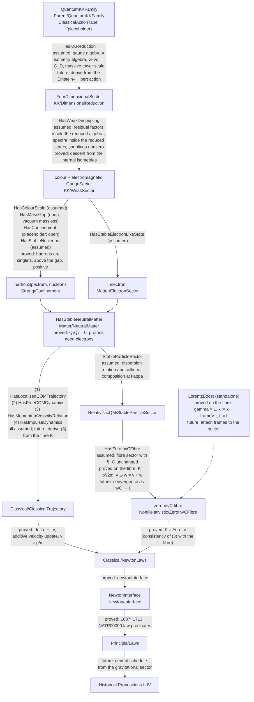

# Reverse programme: from a quantum Kaluza–Klein parent to the Newton interface

The historical libraries read Newton's proofs forward from his own premises.
This directory runs the opposite direction. It starts from a compact modern
parent, a quantum family whose classical geometric action is
higher-dimensional Einstein gravity taken below the cutoff M_D, the
D-dimensional Planck scale fixed by G_D, ℏ and c, and reduces it stage by
stage until the premises consumed by the historical Proposition I–IV files
reappear. What completes the parent above M_D, a string or matrix root, is
left open and never invoked. The
scientific output is the reduction's dependency graph: which modern structures
disappear, which survive, which combine into inherited constants, and which
steps remain physical hypotheses or open problems.

`Reverse/` is modern. It may use modern mathematics within the repository's
Lean-core-only policy, and it may import BarrowLib, ClassicsLib and ModernLib.
Historical files never import it. `Reverse/Principia` imports the historical
law files for their predicates, and the two routes meet at the small shared
Newtonian interface described below.

## Goal

Construct, from the modern parent and an explicit list of named hypotheses,
exactly the Newtonian data consumed by the historical development, and record
at which stage each modern parameter and each physical assumption enters or
leaves.

## Direction

```text
quantum KK gravity                        Reverse/Parent
→ 4D gravity + gauge sectors              Reverse/KK
→ weak-sector decoupling                  Reverse/KK/WeakSector
→ colour: scale, gap, confinement         Reverse/Strong
→ electrons, nucleons, neutral matter     Reverse/Matter
→ stable relativistic quantum composites  Reverse/RelativisticQM
→ zero-invC fibre (kappa = 0)             Reverse/NonRelativistic
→ centre-of-mass assumptions → Law shapes Reverse/Classical
→ Newton interface                        Reverse/Newton
→ edition-local law predicates            Reverse/Principia
→ existing Proposition I–IV machinery     (later)
```

The order is the default working order. If two limits fail to commute under
the hypotheses actually required, that fact is a result and gets recorded.

## Notation

`invC` is 1/c and `kappa` is invC² = 1/c²; neither name is used for a
velocity. `v`, `w` are velocities, `p` a momentum, `K` the rest-subtracted
kinetic energy, `m` a mass, `frameV` a relative frame velocity and `gamma`
the Lorentz factor. The nonrelativistic fibre is `invC = 0`, never `c = ∞`.

## Non-goals

The programme makes no claim, now or as an initial target, to construct
quantum gravity rigorously, solve the 3+1 Yang–Mills mass gap, prove QCD
confinement, derive the Standard Model, construct a gravitational path
integral, or derive nuclear chemistry. Each of these appears as a named
interface whose fields state what is assumed, so that the Newtonian output
visibly depends on it.

## Central methodological rule

No Newton corner is assumed at the root. The parent carries ℏ, `invC`,
gravitational coupling, compactification data and gauge structure, and the
Newtonian sector has to emerge from the stated reductions. The root contains
no classical potential, no `newtonModel` field and no parameter point marked
as Newtonian.

Every file separates five categories and names them in its header:

```text
STATUS:
- theorem
- formal consequence of assumptions
- physical hypothesis
- assumption below the cutoff
- open problem
- heuristic placeholder
```

A statement that depends on the mass gap, confinement, the existence of an
interacting quantum field theory, or quantum gravity keeps that dependence in
its type. Hypotheses carry content-naming identifiers (`HasMassGap`,
`HasConfinement`, `HasStableNucleons`); generic wrappers such as `GoodTheory`
are excluded. There is no `sorry` anywhere in `Reverse/`; missing content is
a named structure or hypothesis.

Two further rules apply after the second pass. A zero fibre is named as a
fibre: `HasZeroInvCFibre` is evaluation at `invC = 0`, and no declaration
claims that finite-c sectors converge to it. A hypothesis that occurs only in
a type, without the data being derived from it, is called a phantom
dependence and is either replaced by a derivation or documented as remaining.

Every substantial file opens with:

```text
PHYSICAL STAGE:
MATHEMATICAL CONTENT:
INPUT PARAMETERS:
OUTPUT PARAMETERS:
PROVED HERE:
ASSUMED HERE:
OPEN PROBLEMS USED:
NEXT REDUCTION:
```

## Two physical lessons built into the architecture

Matter forms before the classical limit. Hadrons, nuclei, atoms and molecules
are quantum bound states, so microscopic ℏ stays nonzero through
`Reverse/Strong` and `Reverse/Matter`. The classical limit acts on the
centre-of-mass theory of already-formed composites, through the
centre-of-mass parameter ε = ℏ / S_CM, while internal quantum structure persists.

Colour leaves the observable sector through confinement and singlet
formation, and the hadronic mass scale is an output of the strong quantum
dynamics via dimensional transmutation. Setting `g₃ = 0` would delete the
mechanism that produces the matter. Electromagnetism stays active
microscopically because it binds atoms; the long-range Coulomb force between
distant bodies vanishes at leading order through neutrality `Q_B = 0`, with
`invC → 0` leaving the coupling untouched. Neutral matter containing protons
requires the electron sector: `protons_need_electrons` is a theorem.

## The shared Newton interface

The historical route consumes a small amount of Newtonian structure, found by
reading the Law I, Law II and Proposition I files:

| Historical consumer | Exact shape | Where defined |
| --- | --- | --- |
| Scalars (time, magnitudes) | `NewtonLimitDynamics.Fraction`, unnormalised signed rationals compared by cross-multiplication | `BarrowLib/Common/RationalMagnitudes.lean` |
| Positions, velocities, impulses | `Point := Fraction × Fraction`, with `pointAdd`, `pointScale`, `pointSub`, `pointEquiv` | `BarrowLib/Polygon/PointAlgebra.lean` |
| Law I (1687, 1713) | `InertialMotion motion := ∀ p v t, pointEquiv (motion p v t) (ZeroForce.inertialAt p v t)` | `NewtonLimitDynamics/Historical/LawI.lean` |
| Lex 1 (NATP00090) | same, restricted to `0 ≤ t.num` | `NewtonLimitDynamics/Historical/LawI.lean` |
| Law II (1687, 1713) | `AdditiveImpulse update := ∀ u v, pointEquiv (update u v) (pointAdd u v)` | `NewtonLimitDynamics/Historical/LawII.lean` |
| Lex 2 (NATP00090) | `CalibratedChange update := ∀ v j, pointEquiv (pointSub (update v j) v) j` | `NewtonLimitDynamics/Historical/LawII.lean` |
| Proposition I coordinate cell | `mechanicalCell motion update a h s`, with a central schedule `a : CentralSchedule.Field` and cell duration `h` | `NewtonLimitDynamics/Historical/AreaLaw.lean` |
| Proposition I synthetic route | `EuclideanConstruction Point Impulse` (two Euclidean identities) | `BarrowLib/Polygon/Finite.lean` |

`Reverse/Newton/Interface.lean` packages the first two law shapes as
`NewtonInterface` using only BarrowLib primitives. `Reverse/Principia/Laws.lean`
proves that the interface produced by the chain satisfies every edition's
law predicates (`modern_to_newton_laws`). The central force schedule `a` is
a separate input: producing it from the gravitational sector is a later
stage of this programme, and Proposition I waits for it.

## Layout and dependency diagram

Edge labels say what each stage assumes and what it proves. The legend is:
**proved** (a theorem in this tree), **assumed** (an interface field),
**open** (a named open problem), **future** (a derivation planned to replace
an assumption).



`Reverse/Chain.lean` composes the stages. `modern_to_newton` constructs the
interface of one body from the parent, KK, weak, strong, electron and matter
hypotheses and the centre-of-mass assumptions (1)–(4); the relativistic
sector and the zero-invC fibre are consumed by `modern_to_newton_kinetic`,
`modern_to_newton_velocity_addition` and
`modern_to_newton_velocity_consistent`, and by nothing in the Law-shape
construction. That gap is the first item of the next pass: derive (3), the
velocity of a momentum, from the fibre kinetic energy, so that the Law shapes
consume the fibre.

Status by stage:

| Stage | Proved now | Assumed now | Open | Future derivation |
| --- | --- | --- | --- | --- |
| Parent | — | existence of the quantum family as an opaque theory per parameter point, taken below the cutoff M_D; Einstein–Hilbert action as a label | completion of gravity above M_D (never invoked as a theorem) | pluggable roots above the cutoff: string or matrix theory |
| KK | residual factors descend from the internal isometries | reduced gauge algebra = isometry algebra; `G · Vol(K) = G_D`; positive massive-tower scale; zero modes untouched | — | the two identities from the action |
| Weak | — | residual su(3), u(1) inside the reduced algebra with nonzero couplings; suppressed parameters recorded, choice open | — | electroweak compactification |
| Strong | hadrons are singlets (from the singlet asymptotic spectrum), above the gap and positive (from the gap); nucleons likewise | positive colour scale; gap above a massless vacuum; singlet asymptotic spectrum carried by the confinement placeholder; nucleon states with mass ratios and charges | Yang–Mills mass gap; confinement proper (placeholder) | — |
| Electron | — | a stable negatively charged massive Dirac state, its mass a parameter of the residual theory | — | origin of the Dirac mass in the collapse K_full → K₅ |
| Matter | `Q₁Q₂ = 0` for neutral bodies; a neutral body with a proton has an electron; constituents are singlets and massive | neutral composites with positive mass; neutrality as a condition on constituent counts | nuclear and atomic many-body theory | mass of the composite from constituents and binding |
| RelativisticQM | — | dispersion relation and collinear composition of each body at the sector's kappa | positive-mass sectors of interacting QFT | both laws from a boost law |
| NonRelativistic | on the fibre: `K = p²/(2m)`, `v ⊕ w = v + w`; standalone: `gamma = 1`, `x' = x − frameV t`, `t' = t`; defect identities and bounds for every kappa | the fibre sector with ℏ, G unchanged | — | convergence as `invC → 0`; frames attached to the sector; non-collinear composition |
| Classical | drift `q + t v`; additive velocity update; `v = p/m`; `K = ½ p · v` on the fibre | (1) localized trajectories; (2) conserved momentum with uniform increments; (3) `p = m v`; (4) additive impulses on momenta | semiclassical analysis | (3) from the fibre `K`; (1), (2) from a Hamiltonian COM limit |
| Principia | the chain's interface satisfies the 1687, 1713 and NATP00090 law predicates | — | — | central impulse schedule for Proposition I |

## Galilean statements: theorems against assumptions

Theorems, each on the fibre `kappa = 0` from a relational relativistic law:
Newtonian kinetic energy `K = p²/(2m)`; collinear velocity composition
`v ⊕ w = v + w`; Lorentz factor `gamma = 1`; Galilean boost
`x' = x − frameV t`; common time `t' = t`. For every kappa the exact defect
identities `2mK + K² kappa = p²` and `composed + kappa v w · composed = v + w`
hold, with bounds linear in kappa on bounded data.

Assumptions, stated in `Reverse/Classical`: the existence of localized
centre-of-mass trajectories; conserved momentum with uniform increments at
the velocity of the current momentum; the velocity of the momentum `m v` is
`v`; additive impulses on momenta. Vector (non-collinear) velocity
composition is assumed nowhere now and proved nowhere; the Law shapes use
additive momenta instead.

## Parameter fates

`Reverse/Parent/Parameters.lean` names the tracked parameters and the
possible fates (`toZero`, `toInfinity`, `remainsFinite`,
`combinesIntoInvariant`, `integratedOut`, `confined`, `unobservable`,
`survivesAsConstant`, `undetermined`). `currentFate` records what the
formalization has established and is `undetermined` for every parameter.
The fibre results evaluate at `invC = 0`, which the fibre interface takes as
given; whether that fibre is required for the Newtonian kinematics (question
1 below) is still open, so even `invC` stays undetermined in the Lean table.
The expectations below are working hypotheses and are kept out of the Lean
table:

| Parameter | Expected fate | Where it should be decided |
| --- | --- | --- |
| `invC` | to zero, by the nonrelativistic limit | `NonRelativistic` (fibre formalized; convergence open) |
| microscopic ℏ | remains finite; the centre-of-mass ε = ℏ/S_CM goes to zero | `Classical` |
| `G_D`, compactification radius | combine into `G`; `G` is free for Propositions I–IV | `KK`; `Principia` |
| cosmological constant | should become invisible before Section II | undecided |
| `g₃` | confined, traded for Λ_colour by transmutation | `Strong` |
| electromagnetic coupling | remains finite; unobservable at leading order between neutral bodies | `Matter` |
| weak couplings, Yukawas, breaking scale | decoupled; which parameter is suppressed is a reduction problem; whether the electron's Dirac mass descends from Yukawa data is a question about the collapse K_full → K₅ | `KK/WeakSector`, `Matter/ElectronSector` |
| particle masses | inherited constants: nucleon masses as ratios times Λ_colour, body masses from binding | `Strong`, `Matter` |

## Kept structures along the descent (a note, 8 October 2026)

This section is a rumination recorded for later work; it changes no
interface. On the way down from the parent to the Newtonian sector, every
limit erases a derivation, and the theory below the limit has to carry the
result as a structure it can state but can no longer explain. The programme
calls such a structure an epicycle, after the historical device, and the
historical device is the right model: epicycles are usually fragments of
the exact motion rather than ad hoc patches, even where a particular one was
born as a patch. A deferent with one epicycle approximates the Kepler
ellipse, a second epicycle improves it (Copernicus used one in place of the
equant), and the series continues: the Fourier expansion of the Kepler
motion in the mean anomaly is a sum of uniformly rotating circles, so a
finite stack of epicycles is a truncation of the exact motion. In the same
way an electrostatic force plus a separate magnetic force is a good
approach to Maxwell's equations: each is the Galilean limit of one part of
the field, and the pair is what survives at `invC = 0`.

Three kinds, in the vocabulary used here:

- **Fragments.** Pieces of one parent structure, each surviving the limit
  as a complete theory of its own, with the symmetry that related them gone.
  Electrostatics and magnetism at `invC = 0` (Le Bellac and Lévy-Leblond
  1973 show that Maxwell's equations have two inequivalent Galilean limits,
  electric and magnetic, according to which fields are held fixed). Mass
  conservation and energy conservation as separate laws. Space and time as
  separate. The trace of the lost unification is a constant or a
  coincidence that the fragments share and cannot explain: the ratio of
  electric to magnetic units, which Weber and Kohlrausch measured in 1856
  and found equal to c; the equality of inertial and gravitational mass;
  the exact equality of proton and electron charge that the neutrality
  condition in `Matter/NeutralMatter` presupposes. The general tool is the
  Inönü–Wigner contraction: a fragment is a parent invariant that the
  contracted group no longer mixes, and the unexplained constant is the
  mixing the contraction removed.
- **Patches.** Added to save phenomena, with no standing of their own:
  Vulcan, Hall's exponent, Newcomb's empirical perihelion term. These are
  the ad hoc auxiliary hypotheses of Popper and Lakatos; the Neptune–Vulcan
  contrast is Lakatos's progressive against degenerating problemshift, and
  the use-novelty criterion of Zahar and Worrall is the philosophers' form
  of the consumption test below.
- **Open anomalies.** A discrepancy carried with no structure at all
  (Mercury's perihelion between 1859 and 1915; here the `open problem`
  category).

Fermi's contact interaction sits between the first two kinds: a fragment of
the electroweak sector that was proposed as a patch, consumed in every
calculation, with a dimensionful coupling that named its own cutoff; here,
an `assumption below the cutoff`. Newton kept a fragment himself: a
corollary to Book III, Proposition VI records that magnetic attraction
fails to scale with the quantity of matter and falls off roughly as the cube
of the distance, so magnetism stands in the Principia as a separate force
with its own law (the corollary's number in each edition is to be checked
against the witnesses before it is cited in a Lean header).

The reverse direction adds a response of its own: the discrepancy stated
exactly, with its mechanism, as a defect identity on the parent side, with
the sector below consuming only the bound. The kinetic-energy and
velocity-composition defects are the two instances so far. The
singular-limit literature (Nickles 1973, Berry 2002, Batterman 2002) is the
part of philosophy of science that addresses this direction; a note on
Berry is kept in `research/action-arguments/`.

The chain currently carries many such structures without deriving them.
The ones identified so far, with their kind and the stage that holds each:

| Kept structure | Kind | Where it is carried | How it is carried now |
| --- | --- | --- | --- |
| fermions as such (spin, exclusion, the spin^c requirement on CP²) | fragment | `Parent/InternalGeometry`, `Matter/ElectronSector` | remark and a Dirac label; exclusion appears nowhere, although extended stable bodies depend on it |
| subatomic particles (quarks behind the confinement placeholder, nucleons, the electron) | fragment | `Strong/Confinement`, `Matter/ElectronSector` | assumed states with mass ratios, charges and a Dirac mass as parameters |
| the Fermi interaction (beta decay selecting the stable nuclei) | fragment born as a patch | `KK/WeakSector` | suppressed before matter forms, so the chain's neutron is stable and its table of stable nuclei is the one with a vanishing Fermi coupling; Section II consumes existence only, so the selection is a phantom there and load-bearing for the actual matter table |
| colour gap and confinement | open anomaly, with a consumed placeholder | `Strong/Confinement` | open problem and placeholder |
| neutrality of bodies, with the charge equality it presupposes | fragment, trace coincidence | `Matter/NeutralMatter` | a condition on constituent counts |
| mass of the composite | fragment | `Matter/NeutralMatter` | a positive parameter; binding is undecided |
| localized trajectories, `p = m v`, additive impulses | fragment | `Classical/ClassicalTrajectory` | the centre-of-mass assumptions (1)–(4), Newton's own kept structures |
| magnetism as a separate force | fragment, in the primary source | historical files (later) | absent from the chain; the Principia carries it |
| cosmological constant | undecided | `Parent/Parameters` | undecided |

What the programme does not yet cover is how each kept structure is held at
each scale, in two senses of the word. The first is the scale of scientific
knowledge: in which theory layer the structure was a postulate and in which
it became a derivation (Newton 1687, the nineteenth-century tables, Fermi
1934, the gauge theory, the parent). The second is the literal scale of
measurement: at which energy, length or time the structure is active, at
which it acts only as a selection rule on the states that survive, and at
which it becomes invisible to the dynamics. The Fermi term is the clearest
case of the two coming apart: invisible as a force at Newton's scale,
decisive as a selection rule at nuclear scales, and a postulate for seventy
years before its derivation. A covering would record, per structure, the
scale at which it is derived, the scale at which it is consumed, the scale
at which it becomes invisible, and the knowledge layer in which it was first
carried. For fragments it would also record the contraction that separates
them and the constant that remembers the mixing. None of that is
formalized; the status headers and the parameter-fate table are the only
present records, and they conflate "decoupled from the forces" with
"finished doing its work". One consequence for the fibre convention: the
zero-invC fibre is unique for the particle kinematics, and for a field
sector it depends on a scaling choice and yields several fragments.

Two rules follow from the discussion and are adopted as working rules,
for fragments and patches alike. A kept structure is worth carrying only
when a proof term consumes it; one present in a type alone is a phantom,
and the reference checker decides which is which. A limit is taken after
the structure it erases has done its explanatory work, and a structure
that would have to be re-added below the limit is evidence that the limit
came too early. The weak decoupling placed before the strong and matter
stages is the one known violation, recorded here as an obligation and left
as it is.

## Questions the architecture is built to answer

1. Is `invC = 0` required for the kinematic assumptions of Propositions
   I–IV, or only sufficient?
2. Is a literal microscopic `ℏ = 0` required, or only the centre-of-mass
   semiclassical limit?
3. Can the electromagnetic coupling stay nonzero while the astronomical
   sector is obtained by restriction to neutral matter?
4. Which part of Newtonian inertial mass is inherited from the strong sector?
5. Does Proposition I–IV need a value of `G`, or is `G` free there?
6. Does the inverse-square law enter Propositions I–IV at all?
7. Which assumptions are kinematic and which belong to particular forces?
8. Which modern constants are invisible before the first four propositions?
9. Do `invC → 0` and `ℏ_eff → 0` commute under the hypotheses required?
10. Which step first needs quantum mechanics for the existence of classical
    matter?

Theorem names and interface fields are chosen so that these can be stated
formally as the chain deepens.

## Build and isolation

```sh
lake build Reverse
grep -rn "import Reverse" NewtonLimitDynamics BarrowLib ClassicsLib ModernLib   # must print nothing
```

`lake build` also builds `Reverse`, as a second default target. The second
command is the historical-isolation check: no historical or supporting
library imports the reverse programme. The reverse direction,
`Reverse/Principia` importing the historical law files, is intended.

## Milestone record

First milestone, 7 October 2026: README; parameter vocabulary; interfaces
for every stage; the shared endpoint packaged in `Newton/Interface`; the
kinetic-energy fibre theorems; the chain composed with its explicit
hypothesis list.

Second pass, 7 October 2026: semantic repairs and the first kinematic
derivations. The notation `invC`/`kappa` is fixed; `HasZeroInvCFibre`
replaces the limit vocabulary; the mass gap leaves the vacuum massless;
gauge invariance, singlet asymptotic spectrum and confinement are separate,
with confinement an explicit placeholder; the residual gauge sectors descend
from the KK output; CP² × S¹ is a residual candidate; neutral matter is built
from counted constituents with the electron sector; the hadron sector is a
defined subtype rather than a phantom carrier; the semiclassical stage is
decomposed into (1)–(4) and the Law shapes are derived from them;
collinear velocity composition, the Lorentz factor and the boost are
Galilean on the fibre by theorem; the chain's interface satisfies the
historical law predicates. `modern_to_newton` depends on the standard axioms
only (`propext`, `Classical.choice`, `Quot.sound`); there is no `sorry` in
the library.

Wording pass, 7 October 2026: low-energy statements are now assumptions
below the cutoff, body masses are masses of composites and the nucleon
mass ratios are inherited constants; the parent is stated below the cutoff
M_D; the electron's Dirac mass
is a parameter of the residual theory, with its Yukawa origin a question
about the collapse K_full → K₅; the spin^c requirement for fermions on
CP² is recorded in `Parent/InternalGeometry.lean`.

Next blockers, in order: derive the momentum–velocity relation (3) from the
fibre kinetic energy, which needs a finite-difference or derivative notion
for `K`; attach frames to the stable-particle sector so that the common time
`t' = t` is consumed by the centre-of-mass stage; state convergence as
`invC → 0` from the defect bounds; produce the central impulse schedule from
the gravitational sector for Proposition I.
