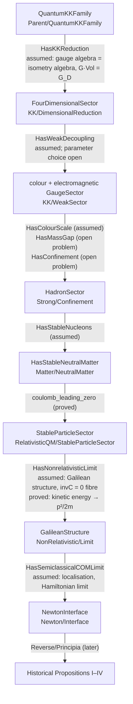

# Reverse programme: from a quantum Kaluza–Klein parent to the Newton interface

The historical libraries read Newton's proofs forward from his own premises.
This directory runs the opposite direction. It starts from a compact modern
parent, a quantum family whose classical geometric action is
higher-dimensional Einstein gravity, and reduces it stage by stage until the
premises consumed by the historical Proposition I–IV files reappear. The
scientific output is the reduction's dependency graph: which modern structures
disappear, which survive, which combine into effective constants, and which
steps remain physical hypotheses or open problems.

`Reverse/` is modern. It may use modern mathematics within the repository's
Lean-core-only policy, and it may import BarrowLib, ClassicsLib and ModernLib.
Historical files never import it. Both routes meet at the small shared
Newtonian interface described below.

## Goal

Construct, from the modern parent and an explicit list of named hypotheses,
exactly the Newtonian data consumed by the historical development, and record
at which stage each modern parameter and each physical assumption enters or
leaves.

## Direction

```text
quantum KK gravity                       Reverse/Parent
→ 4D gravity + gauge sectors             Reverse/KK
→ weak-sector decoupling                 Reverse/KK/WeakSector
→ colour: scale, gap, confinement        Reverse/Strong
→ hadrons, nuclei, neutral matter        Reverse/Matter
→ stable relativistic quantum composites Reverse/RelativisticQM
→ nonrelativistic limit, invC = 0        Reverse/NonRelativistic
→ semiclassical centre-of-mass limit     Reverse/Classical
→ Newton interface                       Reverse/Newton
→ existing Proposition I–IV machinery    Reverse/Principia (later)
```

The order is the default working order. If two limits fail to commute under
the hypotheses actually required, that fact is a result and gets recorded.

## Non-goals

The programme makes no claim, now or as an initial target, to construct
quantum gravity rigorously, solve the 3+1 Yang–Mills mass gap, prove QCD
confinement, derive the Standard Model, construct a gravitational path
integral, or derive nuclear chemistry. Each of these appears as a named
interface whose fields state what is assumed, so that the Newtonian output
visibly depends on it.

## Central methodological rule

No Newton corner is assumed at the root. The parent carries ℏ, `invC`,
gravitational coupling, compactification data and gauge structure, and the
Newtonian sector has to emerge from the stated reductions. The root contains
no classical potential, no `newtonModel` field and no parameter point marked
as Newtonian.

Every file separates five categories and names them in its header:

```text
STATUS:
- theorem
- formal consequence of assumptions
- physical hypothesis
- effective-theory assumption
- open problem
- heuristic placeholder
```

A statement that depends on the mass gap, confinement, the existence of an
interacting quantum field theory, or quantum gravity keeps that dependence in
its type. Hypotheses carry content-naming identifiers (`HasMassGap`,
`HasConfinement`, `HasStableNucleons`); generic wrappers such as `GoodTheory`
are excluded. There is no `sorry` anywhere in `Reverse/`; missing content is
a named structure or hypothesis.

Every substantial file opens with:

```text
PHYSICAL STAGE:
MATHEMATICAL CONTENT:
INPUT PARAMETERS:
OUTPUT PARAMETERS:
PROVED HERE:
ASSUMED HERE:
OPEN PROBLEMS USED:
NEXT REDUCTION:
```

## Two physical lessons built into the architecture

Matter forms before the classical limit. Hadrons, nuclei, atoms and molecules
are quantum bound states, so microscopic ℏ stays nonzero through
`Reverse/Strong` and `Reverse/Matter`. The classical limit acts on the
effective centre-of-mass theory of already-formed composites, through the
effective parameter ε = ℏ / S_CM, while internal quantum structure persists.

Colour leaves the observable sector through confinement and singlet
formation, and the hadronic mass scale is an output of the strong quantum
dynamics via dimensional transmutation. Setting `g₃ = 0` would delete the
mechanism that produces the matter. Electromagnetism stays active
microscopically because it binds atoms; the long-range Coulomb force between
distant bodies vanishes at leading order through neutrality `Q_B = 0`, with
`invC → 0` leaving the coupling untouched.

## The shared Newton interface

The historical route consumes a small amount of Newtonian structure, found by
reading the Law I, Law II and Proposition I files:

| Historical consumer | Exact shape | Where defined |
| --- | --- | --- |
| Scalars (time, magnitudes) | `NewtonLimitDynamics.Fraction`, unnormalised signed rationals compared by cross-multiplication | `BarrowLib/Common/RationalMagnitudes.lean` |
| Positions, velocities, impulses | `Point := Fraction × Fraction`, with `pointAdd`, `pointScale`, `pointSub`, `pointEquiv` | `BarrowLib/Polygon/PointAlgebra.lean` |
| Law I (1687, 1713) | `InertialMotion motion := ∀ p v t, pointEquiv (motion p v t) (ZeroForce.inertialAt p v t)` | `NewtonLimitDynamics/Historical/LawI.lean` |
| Lex 1 (NATP00090) | same, restricted to `0 ≤ t.num` | `NewtonLimitDynamics/Historical/LawI.lean` |
| Law II (1687, 1713) | `AdditiveImpulse update := ∀ u v, pointEquiv (update u v) (pointAdd u v)` | `NewtonLimitDynamics/Historical/LawII.lean` |
| Lex 2 (NATP00090) | `CalibratedChange update := ∀ v j, pointEquiv (pointSub (update v j) v) j` | `NewtonLimitDynamics/Historical/LawII.lean` |
| Proposition I coordinate cell | `mechanicalCell motion update a h s`, with a central schedule `a : CentralSchedule.Field` and cell duration `h` | `NewtonLimitDynamics/Historical/AreaLaw.lean` |
| Proposition I synthetic route | `EuclideanConstruction Point Impulse` (two Euclidean identities) | `BarrowLib/Polygon/Finite.lean` |

`Reverse/Newton/Interface.lean` packages the first two law shapes as
`NewtonInterface` using only BarrowLib primitives. Its `inertial` field is
literally the 1687/1713 `InertialMotion` body, its `additive` field the
`AdditiveImpulse` body; the file proves that the NATP00090 shapes follow.
The bridging theorems that apply the edition-local predicates to a
`NewtonInterface` belong in `Reverse/Principia/` and wait until the law files,
currently modified in the working tree by the historical work, are committed.
The central force schedule `a` is a separate input: producing it from the
gravitational sector is a later stage of this programme.

## Layout and dependency diagram



Edge labels say what each stage assumes and what it proves. Every assumed
edge is a structure whose fields are the assumption; `Reverse/Chain.lean`
composes the stages into `modern_to_newton`, whose argument list is the full
hypothesis list. The chain's only computational content at this milestone is
the composition itself and the kinetic-energy fibre result.

Status by stage:

| Stage | Proved | Assumed (interface) | Open problem used |
| --- | --- | --- | --- |
| Parent | carriers only | existence of the quantum family as an opaque theory per parameter point | quantum gravity (never invoked as a theorem) |
| KK | carriers only | reduced gauge algebra equals the internal isometry algebra; `G · Vol(K) = G_D`; massive tower decouples; zero modes survive | classical KK calculation (formalizable later) |
| Weak | carriers only | a residual su(3) ⊕ u(1) sector with both couplings nonzero; which weak parameter is suppressed stays open | — |
| Strong | hadron states are singlets given confinement | positive colour scale; positive mass gap; confinement; proton/neutron states | 3+1 Yang–Mills mass gap; rigorous confinement |
| Matter | leading Coulomb product `Q₁Q₂ = 0` for neutral bodies | electromagnetic binding into neutral composites with positive effective mass | nuclear and atomic many-body theory |
| RelativisticQM | — | each stable composite obeys the rest-subtracted dispersion relation at the parent's `invC` | positive-mass sectors of interacting QFT |
| NonRelativistic | on the fibre `invC = 0`, each body's kinetic energy is `p²/(2m)`; off the fibre the defect is `K² invC²`, bounded by `B² invC²` on `0 ≤ K ≤ B` | Galilean velocity composition, absolute rational time; `ℏ`, `G` unchanged by the limit | Poincaré → Galilei contraction (formalizable later) |
| Classical | composition into `NewtonInterface` | localised centre-of-mass states; Hamiltonian limit; additive impulses on velocities | semiclassical analysis |

## Parameter fates

`Reverse/Parent/Parameters.lean` names the tracked parameters and the
possible fates (`toZero`, `toInfinity`, `remainsFinite`,
`combinesIntoInvariant`, `integratedOut`, `confined`, `unobservable`,
`survivesEffective`, `undetermined`). `currentFate` records what the
formalization has established; it is `undetermined` for every parameter
except `invC`, whose fibre `invC = 0` is the one formalized limit. The
expectations below are working hypotheses and are kept out of the Lean
table:

| Parameter | Expected fate | Where it should be decided |
| --- | --- | --- |
| `invC` | to zero, by the nonrelativistic limit | `NonRelativistic` (fibre formalized) |
| microscopic ℏ | remains finite; the effective ε = ℏ/S_CM goes to zero | `Classical` |
| `G_D`, compactification radius | combine into `G`; `G` is free for Propositions I–IV | `KK`; `Principia` |
| cosmological constant | should become invisible before Section II | undecided |
| `g₃` | confined, traded for Λ_colour by transmutation | `Strong` |
| electromagnetic coupling | remains finite; unobservable at leading order between neutral bodies | `Matter` |
| weak couplings, Yukawas, breaking scale | decoupled; which parameter is suppressed is a reduction problem | `KK/WeakSector` |
| particle masses | effective constants inherited from Λ_colour and binding | `Strong`, `Matter` |

## Build and isolation

```sh
lake build Reverse
grep -rn "import Reverse" NewtonLimitDynamics BarrowLib ClassicsLib ModernLib   # must print nothing
```

`lake build` also builds `Reverse`, as a second default target. The second
command is the historical-isolation check: no historical or supporting
library imports the reverse programme.

## Milestone record

First milestone (7 October 2026, in progress): README, parameter vocabulary,
interfaces for the parent, KK reduction, weak decoupling, colour sector,
neutral matter, relativistic composite sector, nonrelativistic and
semiclassical limits; the shared endpoint identified and packaged; the
kinetic-energy fibre theorem proved; the chain composed with its explicit
hypothesis list. Files named above that are missing from the tree are the
remaining steps of this milestone.

Next blocking question: factor the edition-local law predicates into a
neutral shared location, or import the law files from `Reverse/Principia/`
once their working-tree changes are committed, and then state Proposition I
for `modern_to_newton`'s output by applying the existing historical theorems.
After that, the first substantive reduction to deepen is the KK relation
between the internal isometry algebra and the reduced gauge algebra.
