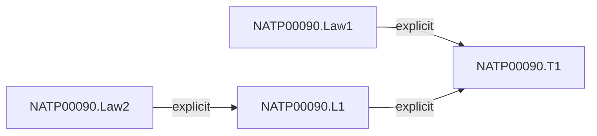
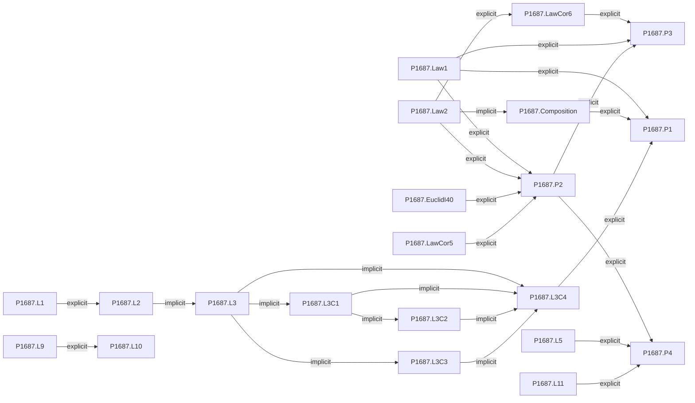
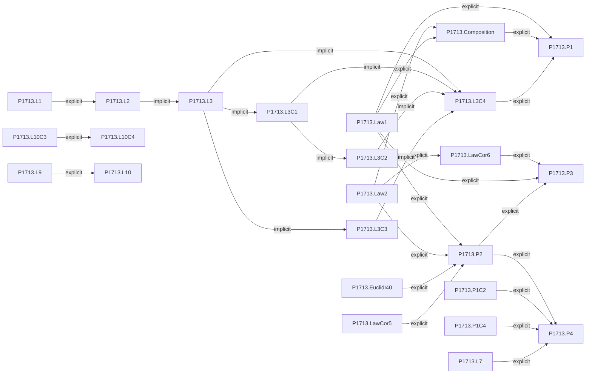
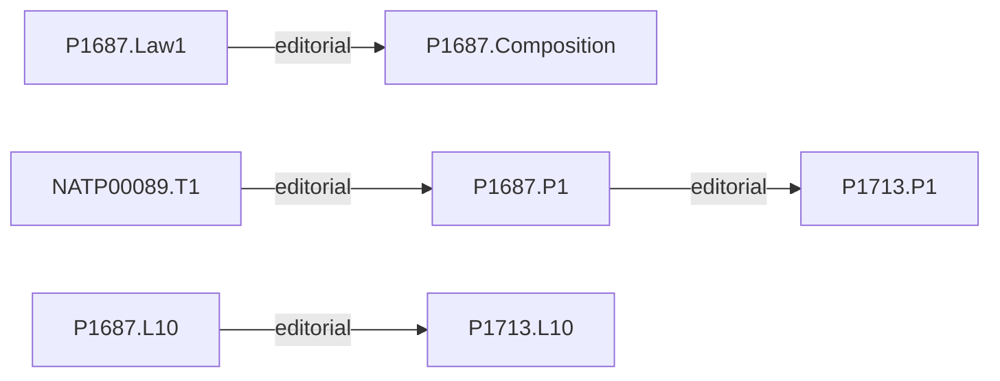
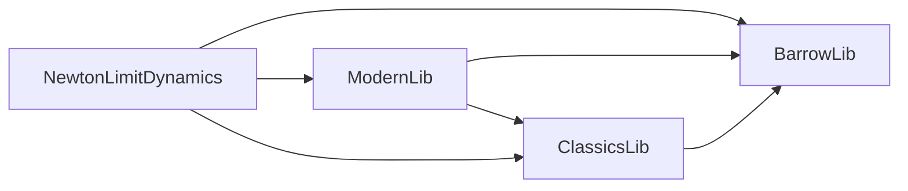
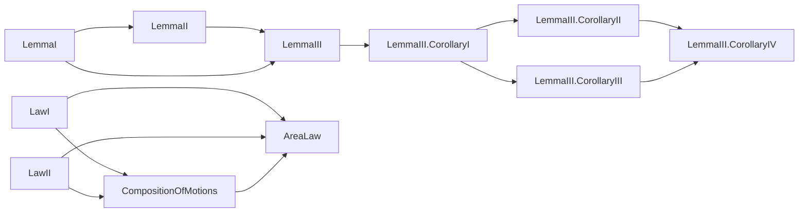

# Current source and Lean dependency figures

Generated by `lake env lean scripts/inspect_graphs.lean` from current historical Lean comments and the compiled environment. Arrows in the source diagrams point from a cited result to the result citing it. Edge status comes from the cited comment; it does not assert a completed formal proof.

The current historical files record no dependency edges for NATP00089 itself, proposed 1694, or 1726. Those omissions are source-comment coverage limits, not claims about the witnesses.

### NATP00089

### NATP00090

- NATP00090.Law2 → NATP00090.L1: [NATP00090.par11](https://www.newtonproject.ox.ac.uk/view/texts/diplomatic/NATP00090#par11); explicit_dependency, confidence high; witness 'De motu sphæricorum corporum in fluidis'; [source](/home/codexssh/newtonlean/NewtonLimitDynamics/Historical/CompositionOfMotions.lean:39).
- NATP00090.Law1 → NATP00090.T1: [NATP00090.par17](https://www.newtonproject.ox.ac.uk/view/texts/diplomatic/NATP00090#par17); explicit_dependency, confidence high; witness 'De motu sphæricorum corporum in fluidis'; [source](/home/codexssh/newtonlean/NewtonLimitDynamics/Historical/AreaLaw.lean:54).
- NATP00090.L1 → NATP00090.T1: [NATP00090.par17](https://www.newtonproject.ox.ac.uk/view/texts/diplomatic/NATP00090#par17); explicit_dependency, confidence high; witness 'De motu sphæricorum corporum in fluidis'; [source](/home/codexssh/newtonlean/NewtonLimitDynamics/Historical/AreaLaw.lean:55).

### 1687

- P1687.Law2 → P1687.Composition: [NATP00076.par4 ("motui ejus ... additur ... componitur") and par8 ("nihil mutabit velocitatem")](https://www.newtonproject.ox.ac.uk/view/texts/diplomatic/NATP00076#par8); implicit_dependency, confidence high; witness Axiomata Sive Leges Motus (1687); [source](/home/codexssh/newtonlean/NewtonLimitDynamics/Historical/CompositionOfMotions.lean:69).
- P1687.Law1 → P1687.P1: [NATP00077.par45](https://www.newtonproject.ox.ac.uk/view/texts/diplomatic/NATP00077#par45); explicit_dependency, confidence high; witness De Motu Corporum (Liber Primus) (1687); [source](/home/codexssh/newtonlean/NewtonLimitDynamics/Historical/AreaLaw.lean:91).
- P1687.Composition → P1687.P1: [NATP00077.par45](https://www.newtonproject.ox.ac.uk/view/texts/diplomatic/NATP00077#par45); explicit_dependency, confidence high; witness De Motu Corporum (Liber Primus) (1687); [source](/home/codexssh/newtonlean/NewtonLimitDynamics/Historical/AreaLaw.lean:92).
- P1687.L3C4 → P1687.P1: [NATP00077.par45](https://www.newtonproject.ox.ac.uk/view/texts/diplomatic/NATP00077#par45); explicit_dependency, confidence high; witness De Motu Corporum (Liber Primus) (1687); [source](/home/codexssh/newtonlean/NewtonLimitDynamics/Historical/AreaLaw.lean:93).
- P1687.Law2 → P1687.LawCor6: [NATP00076.par23](https://www.newtonproject.ox.ac.uk/view/texts/diplomatic/NATP00076#par23); explicit_dependency, confidence high; witness Axiomata Sive Leges Motus (1687); [source](/home/codexssh/newtonlean/NewtonLimitDynamics/Historical/LawsCorollaryVI.lean:22).
- P1687.L1 → P1687.L2: [NATP00077.par4](https://www.newtonproject.ox.ac.uk/view/texts/diplomatic/NATP00077#par4); explicit_dependency, confidence high; witness De Motu Corporum (Liber Primus) (1687); [source](/home/codexssh/newtonlean/NewtonLimitDynamics/Historical/LemmaII.lean:17).
- P1687.L2 → P1687.L3: [NATP00077.par5](https://www.newtonproject.ox.ac.uk/view/texts/diplomatic/NATP00077#par5); implicit_dependency, confidence high; witness De Motu Corporum (Liber Primus) (1687); [source](/home/codexssh/newtonlean/NewtonLimitDynamics/Historical/LemmaIII.lean:16).
- P1687.L3 → P1687.L3C1: [NATP00077.par7](https://www.newtonproject.ox.ac.uk/view/texts/diplomatic/NATP00077#par7); implicit_dependency, confidence high; witness De Motu Corporum (Liber Primus) (1687); [source](/home/codexssh/newtonlean/NewtonLimitDynamics/Historical/LemmaIII/CorollaryI.lean:15).
- P1687.L3C1 → P1687.L3C2: [NATP00077.par8](https://www.newtonproject.ox.ac.uk/view/texts/diplomatic/NATP00077#par8); implicit_dependency, confidence high; witness De Motu Corporum (Liber Primus) (1687); [source](/home/codexssh/newtonlean/NewtonLimitDynamics/Historical/LemmaIII/CorollaryII.lean:15).
- P1687.L3 → P1687.L3C3: [NATP00077.par9](https://www.newtonproject.ox.ac.uk/view/texts/diplomatic/NATP00077#par9); implicit_dependency, confidence medium; witness De Motu Corporum (Liber Primus) (1687); [source](/home/codexssh/newtonlean/NewtonLimitDynamics/Historical/LemmaIII/CorollaryIII.lean:15).
- P1687.L3 → P1687.L3C4: [NATP00077.par10](https://www.newtonproject.ox.ac.uk/view/texts/diplomatic/NATP00077#par10); implicit_dependency, confidence high; witness De Motu Corporum (Liber Primus) (1687); [source](/home/codexssh/newtonlean/NewtonLimitDynamics/Historical/LemmaIII/CorollaryIV.lean:18).
- P1687.L3C1 → P1687.L3C4: [NATP00077.par10](https://www.newtonproject.ox.ac.uk/view/texts/diplomatic/NATP00077#par10); implicit_dependency, confidence high; witness De Motu Corporum (Liber Primus) (1687); [source](/home/codexssh/newtonlean/NewtonLimitDynamics/Historical/LemmaIII/CorollaryIV.lean:19).
- P1687.L3C2 → P1687.L3C4: [NATP00077.par10](https://www.newtonproject.ox.ac.uk/view/texts/diplomatic/NATP00077#par10); implicit_dependency, confidence high; witness De Motu Corporum (Liber Primus) (1687); [source](/home/codexssh/newtonlean/NewtonLimitDynamics/Historical/LemmaIII/CorollaryIV.lean:20).
- P1687.L3C3 → P1687.L3C4: [NATP00077.par10](https://www.newtonproject.ox.ac.uk/view/texts/diplomatic/NATP00077#par10); implicit_dependency, confidence high; witness De Motu Corporum (Liber Primus) (1687); [source](/home/codexssh/newtonlean/NewtonLimitDynamics/Historical/LemmaIII/CorollaryIV.lean:21).
- P1687.L9 → P1687.L10: [NATP00077.par28](https://www.newtonproject.ox.ac.uk/view/texts/diplomatic/NATP00077#par28); explicit_dependency, confidence high; witness De Motu Corporum (Liber Primus) (1687); [source](/home/codexssh/newtonlean/NewtonLimitDynamics/Historical/LemmaX.lean:16).
- P1687.Law1 → P1687.P2: [NATP00077.par49](https://www.newtonproject.ox.ac.uk/view/texts/diplomatic/NATP00077#par49); explicit_dependency, confidence high; witness De Motu Corporum (Liber Primus) (1687); [source](/home/codexssh/newtonlean/NewtonLimitDynamics/Historical/PropositionII.lean:27).
- P1687.Law2 → P1687.P2: [NATP00077.par49](https://www.newtonproject.ox.ac.uk/view/texts/diplomatic/NATP00077#par49); explicit_dependency, confidence high; witness De Motu Corporum (Liber Primus) (1687); [source](/home/codexssh/newtonlean/NewtonLimitDynamics/Historical/PropositionII.lean:28).
- P1687.EuclidI40 → P1687.P2: [NATP00077.par49](https://www.newtonproject.ox.ac.uk/view/texts/diplomatic/NATP00077#par49); explicit_dependency, confidence high; witness De Motu Corporum (Liber Primus) (1687); [source](/home/codexssh/newtonlean/NewtonLimitDynamics/Historical/PropositionII.lean:29).
- P1687.LawCor5 → P1687.P2: [NATP00077.par50](https://www.newtonproject.ox.ac.uk/view/texts/diplomatic/NATP00077#par50); explicit_dependency, confidence high; witness De Motu Corporum (Liber Primus) (1687); [source](/home/codexssh/newtonlean/NewtonLimitDynamics/Historical/PropositionII.lean:30).
- P1687.LawCor6 → P1687.P3: [NATP00077.par54](https://www.newtonproject.ox.ac.uk/view/texts/diplomatic/NATP00077#par54); explicit_dependency, confidence high; witness De Motu Corporum (Liber Primus) (1687); [source](/home/codexssh/newtonlean/NewtonLimitDynamics/Historical/PropositionIII.lean:24).
- P1687.Law1 → P1687.P3: [NATP00077.par54](https://www.newtonproject.ox.ac.uk/view/texts/diplomatic/NATP00077#par54); explicit_dependency, confidence high; witness De Motu Corporum (Liber Primus) (1687); [source](/home/codexssh/newtonlean/NewtonLimitDynamics/Historical/PropositionIII.lean:25).
- P1687.P2 → P1687.P3: [NATP00077.par54](https://www.newtonproject.ox.ac.uk/view/texts/diplomatic/NATP00077#par54); explicit_dependency, confidence high; witness De Motu Corporum (Liber Primus) (1687); [source](/home/codexssh/newtonlean/NewtonLimitDynamics/Historical/PropositionIII.lean:26).
- P1687.P2 → P1687.P4: [NATP00077.par61](https://www.newtonproject.ox.ac.uk/view/texts/diplomatic/NATP00077#par61); explicit_dependency, confidence high; witness De Motu Corporum (Liber Primus) (1687); [source](/home/codexssh/newtonlean/NewtonLimitDynamics/Historical/PropositionIV.lean:24).
- P1687.L5 → P1687.P4: [NATP00077.par61](https://www.newtonproject.ox.ac.uk/view/texts/diplomatic/NATP00077#par61); explicit_dependency, confidence high; witness De Motu Corporum (Liber Primus) (1687); [source](/home/codexssh/newtonlean/NewtonLimitDynamics/Historical/PropositionIV.lean:25).
- P1687.L11 → P1687.P4: [NATP00077.par61](https://www.newtonproject.ox.ac.uk/view/texts/diplomatic/NATP00077#par61); explicit_dependency, confidence high; witness De Motu Corporum (Liber Primus) (1687); [source](/home/codexssh/newtonlean/NewtonLimitDynamics/Historical/PropositionIV.lean:26).

### 1713

- P1713.Law2 → P1713.Composition: [NATP00081.par8](https://www.newtonproject.ox.ac.uk/view/texts/diplomatic/NATP00081#par8); explicit_dependency, confidence high; witness Axiomata Sive Leges Motus (1713); [source](/home/codexssh/newtonlean/NewtonLimitDynamics/Historical/CompositionOfMotions.lean:121).
- P1713.Law1 → P1713.Composition: [NATP00081.par8](https://www.newtonproject.ox.ac.uk/view/texts/diplomatic/NATP00081#par8); explicit_dependency, confidence high; witness Axiomata Sive Leges Motus (1713); [source](/home/codexssh/newtonlean/NewtonLimitDynamics/Historical/CompositionOfMotions.lean:122).
- P1713.Law1 → P1713.P1: [NATP00082.par51](https://www.newtonproject.ox.ac.uk/view/texts/diplomatic/NATP00082#par51); explicit_dependency, confidence high; witness De Motu Corporum (Liber Primus) (1713); [source](/home/codexssh/newtonlean/NewtonLimitDynamics/Historical/AreaLaw.lean:248).
- P1713.Composition → P1713.P1: [NATP00082.par51](https://www.newtonproject.ox.ac.uk/view/texts/diplomatic/NATP00082#par51); explicit_dependency, confidence high; witness De Motu Corporum (Liber Primus) (1713); [source](/home/codexssh/newtonlean/NewtonLimitDynamics/Historical/AreaLaw.lean:249).
- P1713.L3C4 → P1713.P1: [NATP00082.par51](https://www.newtonproject.ox.ac.uk/view/texts/diplomatic/NATP00082#par51); explicit_dependency, confidence high; witness De Motu Corporum (Liber Primus) (1713); [source](/home/codexssh/newtonlean/NewtonLimitDynamics/Historical/AreaLaw.lean:250).
- P1713.Law2 → P1713.LawCor6: [NATP00081.par23](https://www.newtonproject.ox.ac.uk/view/texts/diplomatic/NATP00081#par23); explicit_dependency, confidence high; witness Axiomata Sive Leges Motus (1713); [source](/home/codexssh/newtonlean/NewtonLimitDynamics/Historical/LawsCorollaryVI.lean:39).
- P1713.L1 → P1713.L2: [NATP00082.par5](https://www.newtonproject.ox.ac.uk/view/texts/diplomatic/NATP00082#par5); explicit_dependency, confidence high; witness De Motu Corporum (Liber Primus) (1713); [source](/home/codexssh/newtonlean/NewtonLimitDynamics/Historical/LemmaII.lean:125).
- P1713.L2 → P1713.L3: [NATP00082.par6](https://www.newtonproject.ox.ac.uk/view/texts/diplomatic/NATP00082#par6); implicit_dependency, confidence high; witness De Motu Corporum (Liber Primus) (1713); [source](/home/codexssh/newtonlean/NewtonLimitDynamics/Historical/LemmaIII.lean:101).
- P1713.L3 → P1713.L3C1: [NATP00082.par8](https://www.newtonproject.ox.ac.uk/view/texts/diplomatic/NATP00082#par8); implicit_dependency, confidence high; witness De Motu Corporum (Liber Primus) (1713); [source](/home/codexssh/newtonlean/NewtonLimitDynamics/Historical/LemmaIII/CorollaryI.lean:61).
- P1713.L3C1 → P1713.L3C2: [NATP00082.par9](https://www.newtonproject.ox.ac.uk/view/texts/diplomatic/NATP00082#par9); implicit_dependency, confidence high; witness De Motu Corporum (Liber Primus) (1713); [source](/home/codexssh/newtonlean/NewtonLimitDynamics/Historical/LemmaIII/CorollaryII.lean:50).
- P1713.L3 → P1713.L3C3: [NATP00082.par10](https://www.newtonproject.ox.ac.uk/view/texts/diplomatic/NATP00082#par10); implicit_dependency, confidence medium; witness De Motu Corporum (Liber Primus) (1713); [source](/home/codexssh/newtonlean/NewtonLimitDynamics/Historical/LemmaIII/CorollaryIII.lean:51).
- P1713.L3 → P1713.L3C4: [NATP00082.par11](https://www.newtonproject.ox.ac.uk/view/texts/diplomatic/NATP00082#par11); implicit_dependency, confidence high; witness De Motu Corporum (Liber Primus) (1713); [source](/home/codexssh/newtonlean/NewtonLimitDynamics/Historical/LemmaIII/CorollaryIV.lean:56).
- P1713.L3C1 → P1713.L3C4: [NATP00082.par11](https://www.newtonproject.ox.ac.uk/view/texts/diplomatic/NATP00082#par11); implicit_dependency, confidence high; witness De Motu Corporum (Liber Primus) (1713); [source](/home/codexssh/newtonlean/NewtonLimitDynamics/Historical/LemmaIII/CorollaryIV.lean:57).
- P1713.L3C2 → P1713.L3C4: [NATP00082.par11](https://www.newtonproject.ox.ac.uk/view/texts/diplomatic/NATP00082#par11); implicit_dependency, confidence high; witness De Motu Corporum (Liber Primus) (1713); [source](/home/codexssh/newtonlean/NewtonLimitDynamics/Historical/LemmaIII/CorollaryIV.lean:58).
- P1713.L3C3 → P1713.L3C4: [NATP00082.par11](https://www.newtonproject.ox.ac.uk/view/texts/diplomatic/NATP00082#par11); implicit_dependency, confidence high; witness De Motu Corporum (Liber Primus) (1713); [source](/home/codexssh/newtonlean/NewtonLimitDynamics/Historical/LemmaIII/CorollaryIV.lean:59).
- P1713.L10C3 → P1713.L10C4: [NATP00082.par33](https://www.newtonproject.ox.ac.uk/view/texts/diplomatic/NATP00082#par33); explicit_dependency, confidence high; witness De Motu Corporum (Liber Primus) (1713); [source](/home/codexssh/newtonlean/NewtonLimitDynamics/Historical/LemmaX/CorollaryIV.lean:15).
- P1713.L9 → P1713.L10: [NATP00082.par29](https://www.newtonproject.ox.ac.uk/view/texts/diplomatic/NATP00082#par29); explicit_dependency, confidence high; witness De Motu Corporum (Liber Primus) (1713); [source](/home/codexssh/newtonlean/NewtonLimitDynamics/Historical/LemmaX.lean:78).
- P1713.Law1 → P1713.P2: [NATP00082.par59](https://www.newtonproject.ox.ac.uk/view/texts/diplomatic/NATP00082#par59); explicit_dependency, confidence high; witness De Motu Corporum (Liber Primus) (1713); [source](/home/codexssh/newtonlean/NewtonLimitDynamics/Historical/PropositionII.lean:51).
- P1713.Law2 → P1713.P2: [NATP00082.par59](https://www.newtonproject.ox.ac.uk/view/texts/diplomatic/NATP00082#par59); explicit_dependency, confidence high; witness De Motu Corporum (Liber Primus) (1713); [source](/home/codexssh/newtonlean/NewtonLimitDynamics/Historical/PropositionII.lean:52).
- P1713.EuclidI40 → P1713.P2: [NATP00082.par59](https://www.newtonproject.ox.ac.uk/view/texts/diplomatic/NATP00082#par59); explicit_dependency, confidence high; witness De Motu Corporum (Liber Primus) (1713); [source](/home/codexssh/newtonlean/NewtonLimitDynamics/Historical/PropositionII.lean:53).
- P1713.LawCor5 → P1713.P2: [NATP00082.par60](https://www.newtonproject.ox.ac.uk/view/texts/diplomatic/NATP00082#par60); explicit_dependency, confidence high; witness De Motu Corporum (Liber Primus) (1713); [source](/home/codexssh/newtonlean/NewtonLimitDynamics/Historical/PropositionII.lean:54).
- P1713.LawCor6 → P1713.P3: [NATP00082.par65](https://www.newtonproject.ox.ac.uk/view/texts/diplomatic/NATP00082#par65); explicit_dependency, confidence high; witness De Motu Corporum (Liber Primus) (1713); [source](/home/codexssh/newtonlean/NewtonLimitDynamics/Historical/PropositionIII.lean:44).
- P1713.Law1 → P1713.P3: [NATP00082.par65](https://www.newtonproject.ox.ac.uk/view/texts/diplomatic/NATP00082#par65); explicit_dependency, confidence high; witness De Motu Corporum (Liber Primus) (1713); [source](/home/codexssh/newtonlean/NewtonLimitDynamics/Historical/PropositionIII.lean:45).
- P1713.P2 → P1713.P3: [NATP00082.par65](https://www.newtonproject.ox.ac.uk/view/texts/diplomatic/NATP00082#par65); explicit_dependency, confidence high; witness De Motu Corporum (Liber Primus) (1713); [source](/home/codexssh/newtonlean/NewtonLimitDynamics/Historical/PropositionIII.lean:46).
- P1713.P2 → P1713.P4: [NATP00082.par72](https://www.newtonproject.ox.ac.uk/view/texts/diplomatic/NATP00082#par72); explicit_dependency, confidence high; witness De Motu Corporum (Liber Primus) (1713); [source](/home/codexssh/newtonlean/NewtonLimitDynamics/Historical/PropositionIV.lean:44).
- P1713.P1C2 → P1713.P4: [NATP00082.par72](https://www.newtonproject.ox.ac.uk/view/texts/diplomatic/NATP00082#par72); explicit_dependency, confidence high; witness De Motu Corporum (Liber Primus) (1713); [source](/home/codexssh/newtonlean/NewtonLimitDynamics/Historical/PropositionIV.lean:45).
- P1713.P1C4 → P1713.P4: [NATP00082.par72](https://www.newtonproject.ox.ac.uk/view/texts/diplomatic/NATP00082#par72); explicit_dependency, confidence high; witness De Motu Corporum (Liber Primus) (1713); [source](/home/codexssh/newtonlean/NewtonLimitDynamics/Historical/PropositionIV.lean:46).
- P1713.L7 → P1713.P4: [NATP00082.par72](https://www.newtonproject.ox.ac.uk/view/texts/diplomatic/NATP00082#par72); explicit_dependency, confidence high; witness De Motu Corporum (Liber Primus) (1713); [source](/home/codexssh/newtonlean/NewtonLimitDynamics/Historical/PropositionIV.lean:47).

### Editorial and cross-witness comparisons

- P1687.Law1 → P1687.Composition: [NATP00076.par1 ("movendi uniformiter in directum") and par7 ("eodem tempore")](https://www.newtonproject.ox.ac.uk/view/texts/diplomatic/NATP00076#par7); editorial_interpretation, confidence medium; witness Axiomata Sive Leges Motus (1687); [source](/home/codexssh/newtonlean/NewtonLimitDynamics/Historical/CompositionOfMotions.lean:70).
- NATP00089.T1 → P1687.P1: [NATP00077.par45](https://www.newtonproject.ox.ac.uk/view/texts/diplomatic/NATP00077#par45); editorial_interpretation, confidence high; witness De Motu Corporum (Liber Primus) (1687); [source](/home/codexssh/newtonlean/NewtonLimitDynamics/Historical/AreaLaw.lean:94).
- P1687.P1 → P1713.P1: [NATP00082.par51](https://www.newtonproject.ox.ac.uk/view/texts/diplomatic/NATP00082#par51); editorial_interpretation, confidence high; witness De Motu Corporum (Liber Primus) (1713); [source](/home/codexssh/newtonlean/NewtonLimitDynamics/Historical/AreaLaw.lean:251).
- P1687.L10 → P1713.L10: [NATP00082.par28](https://www.newtonproject.ox.ac.uk/view/texts/diplomatic/NATP00082#par28); editorial_interpretation, confidence high; witness De Motu Corporum (Liber Primus) (1713); [source](/home/codexssh/newtonlean/NewtonLimitDynamics/Historical/LemmaX.lean:79).

## Lean code relationships

The following arrows are current file imports between project libraries (importer → imported library). They classify compilation reachability only.

### Library imports

The next arrows mean at least one compiled declaration in the target historical file **directly** uses a constant from the source historical file in its type or body. Private helpers are included. 173 compiled historical declarations were inspected; same-file and supporting-library uses are suppressed for readability. These direct formal uses are distinct from source-comment edges and from file imports.

### Direct cross-file formal uses

No diagram certifies the full Proposition I–IV chain, the polygon-to-curve step, or a historical premise merely because a file or declaration is reachable. Read the named Lean statements and their supplied hypotheses for scope.
