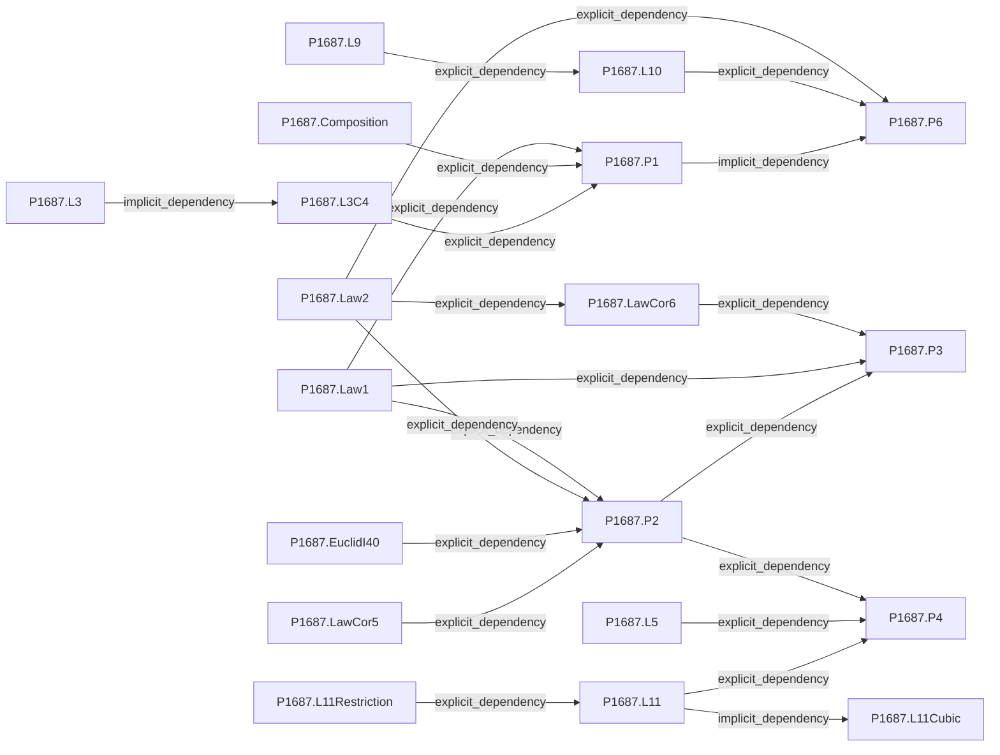
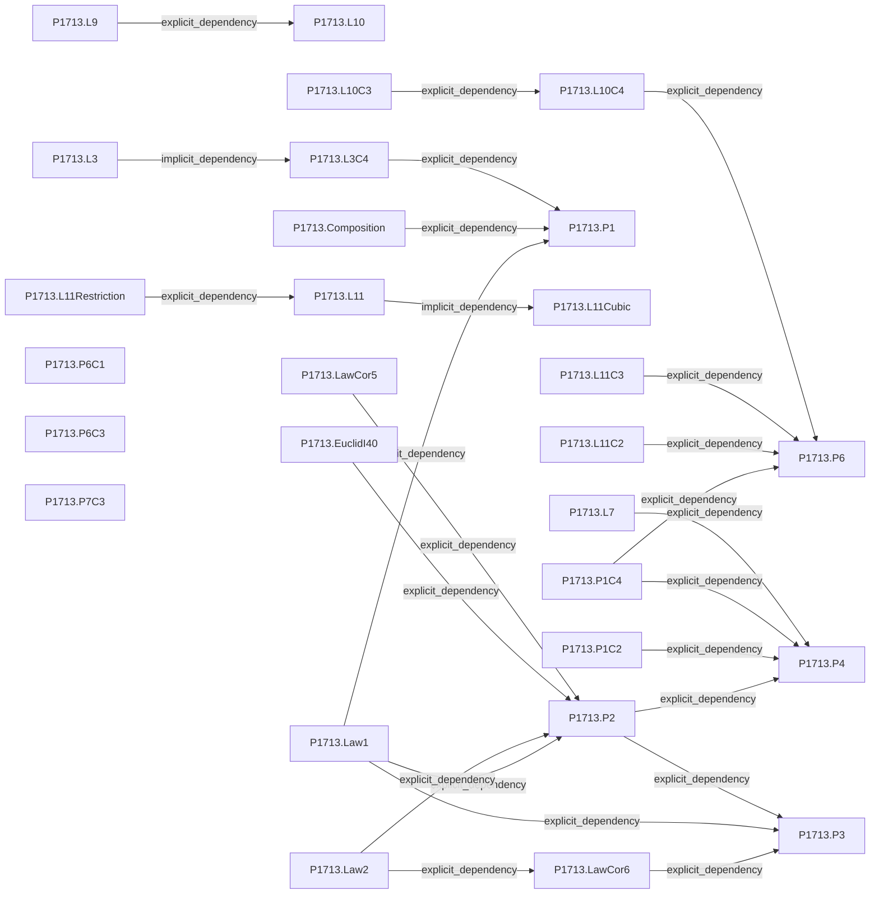
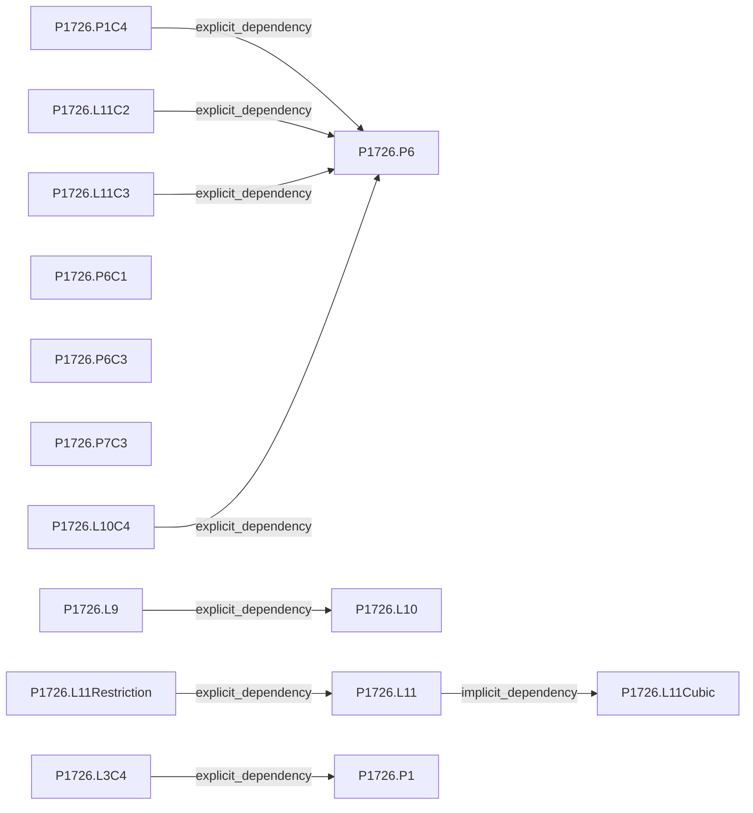
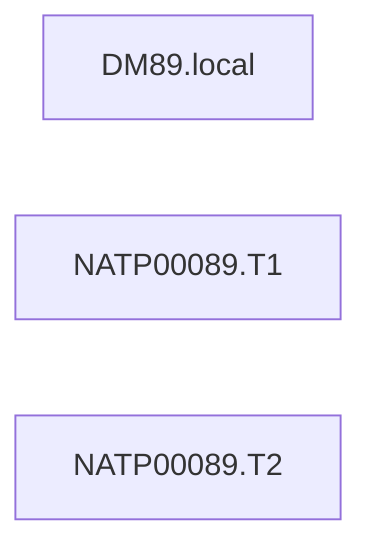
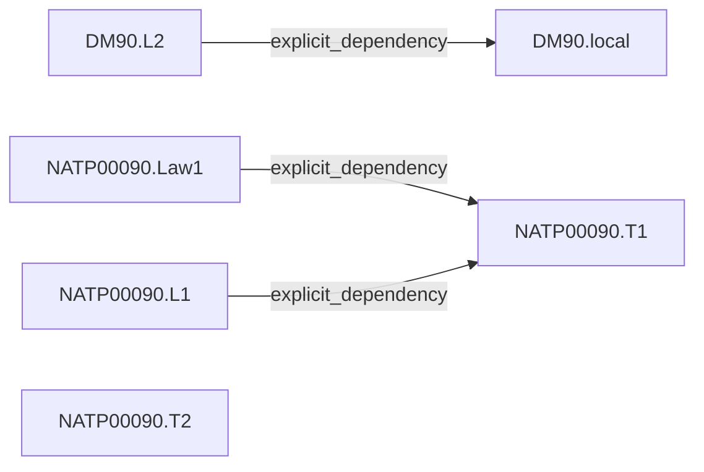
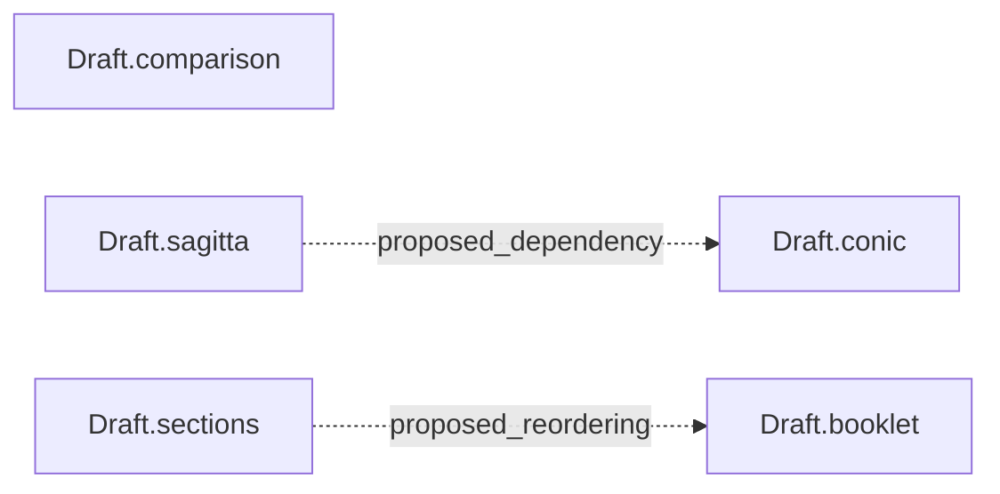

# Evidence graphs

Generated by scripts/check_graph.py. Isolated nodes mean no accepted edge, not independence. Proposed edges are not accepted proof dependencies.

## 1687

## 1713

## 1726

## NATP00089

## NATP00090

## RS-copy-reprint

## proposed1694

## comparison

```mermaid
flowchart LR
  n0["DM89.local"]
  n1["DM90.L2"]
  n2["DM90.local"]
  n3["P1687.L9"]
  n4["P1687.L10"]
  n5["P1713.L9"]
  n6["P1713.L10"]
  n7["P1713.L10C3"]
  n8["P1713.L10C4"]
  n9["RS.H4"]
  n10["P1687.P1"]
  n11["P1687.L3"]
  n12["P1687.L3C4"]
  n13["P1687.Law1"]
  n14["P1687.Composition"]
  n15["P1713.P1"]
  n16["P1713.L3"]
  n17["P1713.L3C4"]
  n18["P1713.Law1"]
  n19["P1713.Composition"]
  n20["NATP00089.T1"]
  n21["NATP00090.T1"]
  n22["P1687.L11"]
  n23["P1687.L11Cubic"]
  n24["P1687.L11Restriction"]
  n25["P1713.L11"]
  n26["P1713.L11Cubic"]
  n27["P1713.L11Restriction"]
  n28["P1713.P6"]
  n29["P1713.P1C4"]
  n30["P1713.L11C2"]
  n31["P1713.L11C3"]
  n32["P1713.P6C1"]
  n33["P1713.P6C3"]
  n34["P1713.P7C3"]
  n35["P1726.P6"]
  n36["P1726.P1C4"]
  n37["P1726.L11C2"]
  n38["P1726.L11C3"]
  n39["P1726.P6C1"]
  n40["P1726.P6C3"]
  n41["P1726.P7C3"]
  n42["P1726.L9"]
  n43["P1726.L10"]
  n44["P1726.L10C4"]
  n45["P1726.L11"]
  n46["P1726.L11Cubic"]
  n47["P1726.L11Restriction"]
  n48["P1726.P1"]
  n49["P1726.L3C4"]
  n50["P1687.P6"]
  n51["P1687.Law2"]
  n52["NATP00089.T2"]
  n53["NATP00090.Law1"]
  n54["NATP00090.L1"]
  n55["NATP00090.T2"]
  n56["P1687.P2"]
  n57["P1687.P3"]
  n58["P1687.P4"]
  n59["P1687.L5"]
  n60["P1687.LawCor5"]
  n61["P1687.LawCor6"]
  n62["P1687.EuclidI40"]
  n63["P1713.P2"]
  n64["P1713.P3"]
  n65["P1713.P4"]
  n66["P1713.L7"]
  n67["P1713.P1C2"]
  n68["P1713.Law2"]
  n69["P1713.LawCor5"]
  n70["P1713.LawCor6"]
  n71["P1713.EuclidI40"]
  n72["Draft.comparison"]
  n73["Draft.sagitta"]
  n74["Draft.conic"]
  n75["Draft.sections"]
  n76["Draft.booklet"]
  n4 -.->|editorial_interpretation| n6
  n9 -.->|editorial_interpretation| n1
  n20 -.->|editorial_interpretation| n10
  n10 -.->|editorial_interpretation| n15
  n22 -.->|editorial_interpretation| n25
  n50 -.->|editorial_interpretation| n32
  n28 -.->|editorial_interpretation| n35
  n33 -.->|editorial_interpretation| n40
  n26 -.->|editorial_interpretation| n46
  n72 -.->|editorial_interpretation| n34
```

