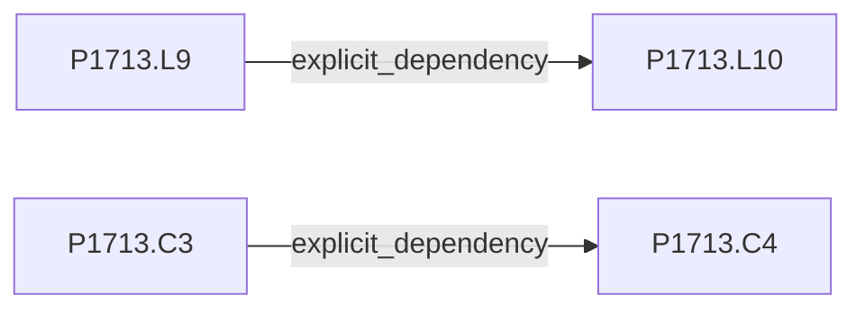
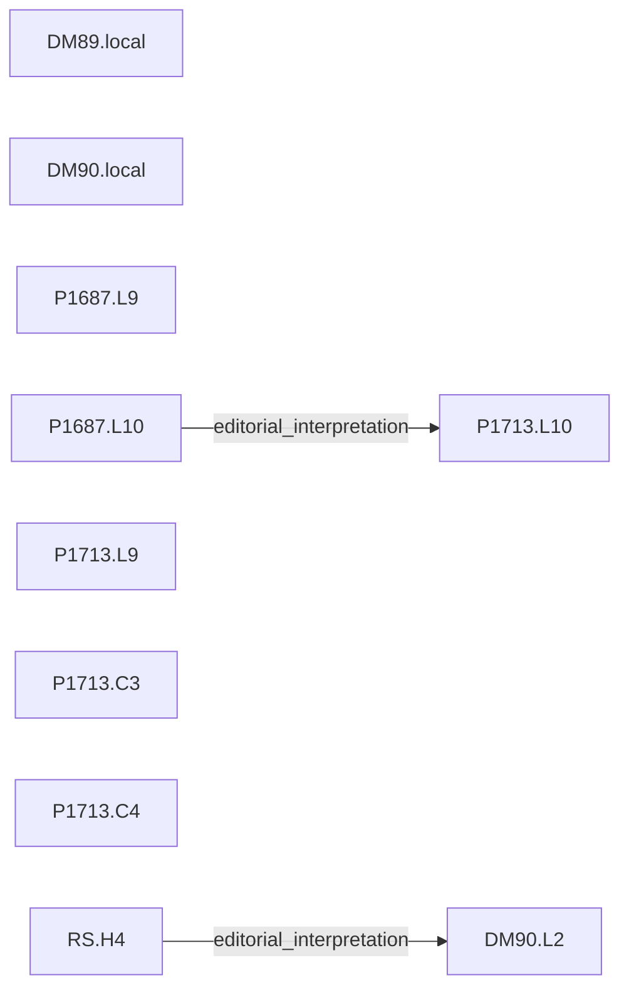

# M1 evidence graphs

Generated by scripts/check_graph.py. Isolated nodes mean no accepted edge, not independence.

## 1687

## 1713

## NATP00089

## NATP00090

## RS-copy-reprint

## comparison

